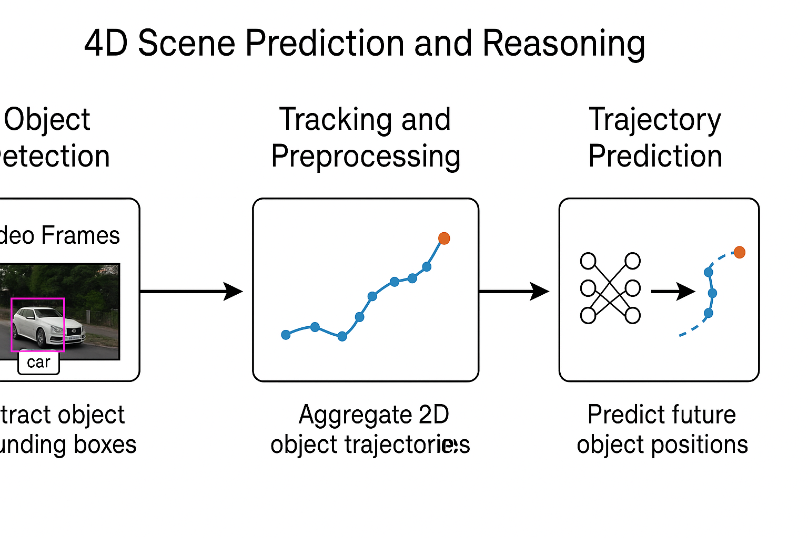

# 🧠 4D Scene Prediction and Trajectory Reasoning

This project predicts the future motion of objects in real-world driving scenes using 3D object tracking, temporal learning, and visual reasoning.  
It reconstructs object trajectories from RGB-D video, forecasts future positions using GRU, and explains predicted behaviors using GPT-4.

---

## 🧩 Key Features

- ✅ YOLOv8 + DeepSORT multi-object tracking
- ✅ 3D trajectory recovery using depth and camera poses
- ✅ GRU-based prediction of future object motion
- ✅ Panda3D 3D visualization of observed + predicted paths
- ✅ GPT-4 text-based motion explanations

---

## 🧠 Pipeline Overview



---

## 📁 Project Structure

```
4d_scene_prediction/
├── data/                    # Input RGB, depth, detections, tracks
├── models/                  # GRU-based prediction models
├── scripts/                 # Detection, tracking, trajectory, LLM
├── outputs/                 # Trajectories, predictions, explanations
├── assets/                  # Optional 3D models
├── pipeline.png             # Diagram of the full pipeline
├── requirements.txt         # Python dependencies
└── README.md
```

---

## 🚀 Quick Start

1. **Clone this repo and install dependencies:**
```bash
git clone https://github.com/youcefgheffari3/4d-scene-prediction.git
cd 4d-scene-prediction
pip install -r requirements.txt
```

2. **Run the full pipeline:**
```bash
python scripts/generate_detections.py       # YOLOv8 object detection
python scripts/track_objects.py             # DeepSORT multi-object tracking
python scripts/build_trajectories.py        # Create 3D world-space trajectories
python scripts/predict_future.py            # GRU-based motion prediction
python scripts/visualize_scene.py           # Panda3D visualization
python scripts/explain_motion_llm.py        # GPT-4 motion explanation
python scripts/export_results.py            # Final export of all results
```

---

## 🎯 Example Outputs

- 📍 `trajectory_prediction.json`: predicted 3D future motion
- 🖼️ `trajectory_viz.png`: rendered 3D motion path
- 💬 `gpt4_explanation.txt`: natural language explanation

---

## 🧠 Tech Stack

| Component | Tool/Library |
|-----------|-------------|
| Object Detection | YOLOv8 (Ultralytics) |
| Tracking | DeepSORT |
| Trajectory Forecast | GRU (PyTorch) |
| 3D Rendering | Panda3D |
| Scene Reasoning | GPT-4 / OpenAI API |

---

## 📜 License

MIT License

---

## 🙋‍♂️ Author

Made by [@youcefgheffari3](https://github.com/youcefgheffari3) — AI/Computer Vision Engineer & Researcher
